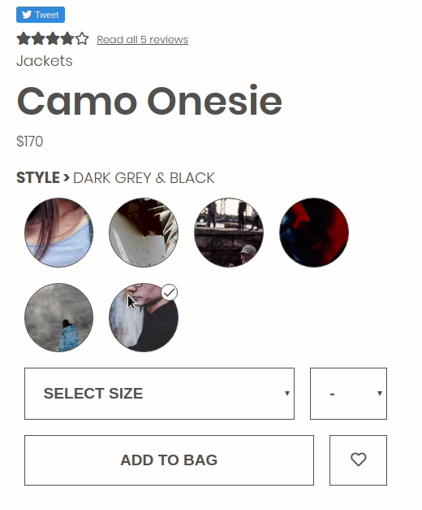
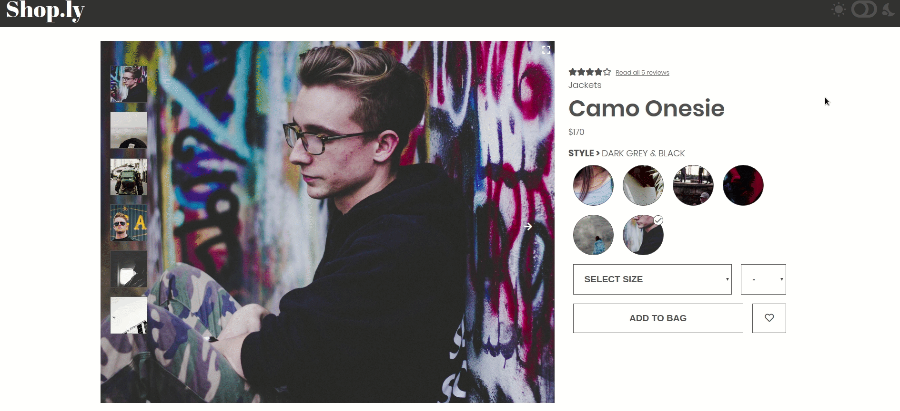

# Shop.ly

Shop.ly is a dynamic product page for an online shopping platform.

## Building and running on localhost
```bash
$ npm install
$ npm run build-dev
$ npm run server
```

To create a production build:

```bash
$ npm run build-prod
```

## Running
Open http://localhost:7000/product_details/25 in a browser of your choice.
Changing the number at the end of the url will update the page with the product you're viewing.

**make sure that redux devtools are removed from store.js, or the page will only load in a browser with the devtools installed.**

To remove, navigate to ./store.js, and make these lines of code look as such:
```javascript
const store = createStore(
  rootReducer,
  initialState,
  compose(
    applyMiddleware(thunk)
    // window.__REDUX_DEVTOOLS_EXTENSION__ &&
    //   window.__REDUX_DEVTOOLS_EXTENSION_COMPOSE__()
  )
);
```

## About
This project is built with using React,Redux, React Router, Node.js and Jest/Enzyme for testing.

### Product Overview
The Product Overview module comprised of the image gallery, product options, and product information components. This module also required the implementation of a dark mode toggle.

#### Demos/Screenshots
##### Image Gallery
The image gallery component allows the user to browse product images available for the product's currently selected style. The user can navigate available images by directly selecting images in the carousel (left-hand side) or by clicking the arrows on either side of the gallery. The gallery can also be expanded to provide for a more focused view.


##### Product Options
The product options component provides a view of the current product's category, name, price, and available styles. The user may select a style to view available sizes and product images. Once a size is selected, the user may then select a quantity, 'like' the product if desired, and add it to their cart.


##### Dark mode
A dark mode toggle is provided in the navigation bar. By default, the page will render the theme preferred by the user's browser (i.e., dark mode will be toggled automatically if the browser's theme is set to dark).


## Credits

Made by team grey-octopus

## License
[MIT](https://choosealicense.com/licenses/mit/)
